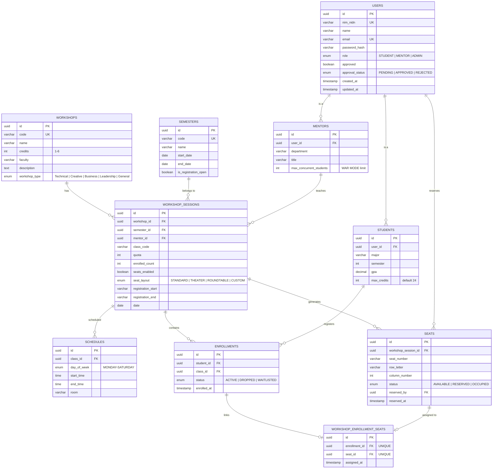

# Workshop Platform - Dokumentasi Sistem

> Sistem Pendaftaran Workshop Interaktif - Universitas Kristen Satya Wacana

**Versi 3.0 • Februari 2026**

---

## Daftar Isi
1. [Gambaran Sistem](#gambaran-sistem)
2. [Tech Stack](#tech-stack)
3. [Use Case Diagram](#use-case-diagram)
4. [Class Diagram](#class-diagram)
5. [Entity Relationship Diagram](#entity-relationship-diagram)
6. [Component Diagram](#component-diagram)
7. [Sequence Diagram](#sequence-diagram)
8. [State Diagram](#state-diagram)
9. [Activity Diagram](#activity-diagram)
10. [Data Flow Diagram](#data-flow-diagram)
11. [System Flowchart](#system-flowchart)
12. [Referensi API](#referensi-api)
13. [Konfigurasi Redis Keys](#konfigurasi-redis-keys)
14. [Struktur Proyek](#struktur-proyek)
15. [Penjelasan Detail: Kafka, Redis, dan WebSocket](#penjelasan-detail-kafka-redis-dan-websocket)
16. [Penjelasan Bahasa Bayi (Analogi Sederhana)](#-penjelasan-bahasa-bayi-analogi-sederhana)

---

## Gambaran Sistem

**Workshop Platform** adalah sistem pendaftaran workshop berperforma tinggi yang dirancang untuk menangani lonjakan trafik pendaftaran ("War Workshop"). Sistem menggunakan arsitektur **Event-Driven** dengan Apache Kafka untuk menjamin urutan antrian yang adil (FIFO) dan WebSocket untuk pengalaman real-time.

### Fitur Utama

| Fitur | Deskripsi |
|-------|-----------|
| 🚀 High Concurrency (WAR MODE) | Mampu menangani ratusan request per detik dengan mekanisme antrian Kafka dan slot-based concurrency control |
| 📡 Real-time Updates | WebSocket hub untuk notifikasi instan: status antrian, ketersediaan kursi, dan promosi otomatis |
| 🔒 Distributed Locking | Redis SETNX untuk mencegah "double booking" pada kursi dan race conditions |
| 📊 Interactive Seat Map | Seat map visual real-time untuk memilih tempat duduk dengan status live |
| 👥 User Management | Sistem registrasi dengan approval workflow (PENDING → APPROVED/REJECTED) |
| 📅 Registration Windows | Tanggal buka/tutup pendaftaran per workshop dengan validasi otomatis |
| 🗓️ Mentor Schedule Calendar | Kalender jadwal interaktif real-time dengan navigasi mingguan |
| 🚦 Traffic Control | Dashboard monitoring untuk melihat active users dan waiting queue secara real-time |
| 📚 Credit Limit Management | Mentor dapat mengatur batas kredit per mahasiswa |
| ⏰ Auto-Cleanup | Background workers untuk expired slots, expired seat reservations, dan past workshops |
| 📈 Observability | Distributed tracing dengan Jaeger & OpenTelemetry |
| 🔐 Single Session Auth | JWT auth dengan single-session enforcement via Redis |

---

## Tech Stack

| Layer | Teknologi | Versi | Deskripsi |
|-------|-----------|-------|-----------|
| **Frontend** | React + Vite | - | SPA dengan Tailwind CSS, hot-reload dev server |
| **Backend** | Go + Gin | 1.x | REST API gateway, WebSocket hub, background workers |
| **Database** | PostgreSQL | 15 | Relational database utama, UUID primary keys |
| **Cache** | Redis | 7 | Distributed locks, session management, queue state |
| **Message Broker** | Apache Kafka | 7.5 | FIFO queue untuk WAR MODE, Zookeeper-managed |
| **Migration** | Flyway | 10 | Database schema versioning (12 migration files) |
| **Observability** | Jaeger | latest | Distributed tracing via OTLP |
| **Containerization** | Docker Compose | 3.8 | 7 services: postgres, flyway, redis, zookeeper, kafka, backend, frontend, jaeger |

---

## Use Case Diagram

Menunjukkan interaksi antara aktor dengan sistem.

```mermaid
flowchart LR
    subgraph Actors["👥 Aktor"]
        S["🎓 Mahasiswa"]
        M["👨‍🏫 Mentor"]
        T["⏰ System Timer"]
    end
    
    subgraph System["🏢 Workshop Platform"]
        UC1["🔐 Login/Register"]
        UC2["📝 Join Queue"]
        UC3["💺 Select Seat"]
        UC4["✅ Enroll Workshop"]
        UC5["📚 Manage Workshops"]
        UC6["👀 Monitor Traffic"]
        UC7["✔️ Approve/Reject Users"]
        UC8["🗑️ Cleanup Expired"]
        UC9["📅 View Schedule Calendar"]
        UC10["📊 Manage Credit Limits"]
        UC11["📋 View Enrolled Students"]
        UC12["🗓️ Set Registration Dates"]
    end
    
    S --> UC1
    S --> UC2
    S --> UC3
    S --> UC4
    
    M --> UC1
    M --> UC5
    M --> UC6
    M --> UC7
    M --> UC9
    M --> UC10
    M --> UC11
    M --> UC12
    
    T --> UC8
```



**Penjelasan:**
- **Mahasiswa**: Dapat register/login, bergabung ke antrian (WAR MODE), memilih kursi di seat map, dan mendaftar workshop.
- **Mentor**: Dapat mengelola workshop (CRUD), memonitor trafik antrian (active/waiting users), menyetujui/menolak pendaftaran user, melihat jadwal kalender, mengelola batas kredit mahasiswa, dan mengatur tanggal registrasi.
- **System Timer**: Background workers yang membersihkan slot expired, seat reservations expired, dan menandai workshop lampau sebagai "done".

---

## Class Diagram

Struktur objek dalam sistem dengan inheritance dan relasi.


**Penjelasan:**
- **User**: Class dasar dengan inheritance ke Student dan Mentor. Memiliki approval workflow (PENDING → APPROVED/REJECTED).
- **Workshop → WorkshopSession**: Satu workshop memiliki banyak sesi. Setiap sesi memiliki quota, mentor, jadwal, dan konfigurasi kursi.
- **WorkshopSession → Schedule**: Setiap sesi memiliki jadwal (hari, waktu, ruangan).
- **WorkshopSession → Seat**: Kursi di-generate otomatis berdasarkan quota (layout: A1, A2, ... B1, B2, ...).
- **Enrollment → SeatAssignment**: Menghubungkan enrollment dengan seat yang dipilih (via tabel pivot `workshop_enrollment_seats`).
- **Mentor → WorkshopSession**: Mentor mengajar sesi tertentu dan bisa memantau via dashboard.

---

## Entity Relationship Diagram

Struktur database relasional PostgreSQL.



**Penjelasan:**
- **USERS**: Tabel utama dengan role (STUDENT/MENTOR/ADMIN), approval workflow, dan auto-approve trigger untuk staff.
- **STUDENTS**: Menyimpan info akademik (major, semester, GPA, max_credits) dengan relasi ke users.
- **MENTORS**: Menyimpan department, title, dan batas concurrent students untuk WAR MODE.
- **WORKSHOPS → WORKSHOP_SESSIONS**: Workshop adalah katalog, session adalah instansi spesifik dengan quota, jadwal, dan mentor.
- **SEATS**: Kursi dengan status lifecycle (AVAILABLE → RESERVED → OCCUPIED), di-generate otomatis via SQL function.
- **WORKSHOP_ENROLLMENT_SEATS**: Tabel pivot (1:1) yang menghubungkan enrollment unik dengan seat unik.

---

## Component Diagram

Arsitektur microservice sistem.

```mermaid
flowchart TB
    subgraph Frontend["🖥️ Frontend Layer"]
        FE["React SPA\n(Vite + Tailwind CSS)"]
        FE_PAGES["Pages:\nLogin | Register | Welcome\nQueue | WorkshopSelection\nRegistrationSuccess\nMentorDashboard"]
        FE_COMP["Components:\nSeatMap | UserManagement\nToast | SessionTimeoutModal\nLoadingSpinner | Header"]
    end
    
    subgraph Backend["⚙️ Backend Services (Go + Gin)"]
        API["API Gateway\n(REST Handlers)"]
        WS["WebSocket Hub\n(Gorilla WS)"]
        AUTH["Auth Service\n(JWT + Redis Sessions)"]
        QUEUE["Queue Service\n(WAR MODE Logic)"]
        SEAT["Seat Service\n(Distributed Locking)"]
        USRMGMT["User Management\n(Approval Workflow)"]
        CREDIT["Credit Limit\nService"]
        WORKERS["Background Workers:\n• Slot Cleanup\n• Seat Expiry\n• Past Workshop Checker"]
    end
    
    subgraph Messaging["📨 Message Broker"]
        KAFKA["Apache Kafka\nTopic: queue.join\n(Zookeeper-managed)"]
    end
    
    subgraph Cache["⚡ Cache Layer"]
        REDIS["Redis 7\n(Locks, Sessions,\nQueue State)"]
    end
    
    subgraph Database["💾 Persistence"]
        PG["PostgreSQL 15\n(Flyway-managed migrations)"]
    end
    
    subgraph Observability["📈 Observability"]
        JAEGER["Jaeger\n(Distributed Tracing\nvia OTLP)"]
    end
    
    FE <-->|"HTTP/REST"| API
    FE <-->|"WebSocket"| WS
    
    API --> AUTH
    API --> QUEUE
    API --> SEAT
    API --> USRMGMT
    API --> CREDIT
    
    QUEUE -->|"Produce"| KAFKA
    KAFKA -->|"Consume"| QUEUE
    
    QUEUE --> REDIS
    SEAT --> REDIS
    AUTH --> REDIS
    
    API --> PG
    SEAT --> PG
    USRMGMT --> PG
    CREDIT --> PG
    WORKERS --> REDIS
    WORKERS --> PG
    
    API -.->|"OTLP"| JAEGER
```



**Penjelasan:**
- **Frontend**: SPA React dengan 8 halaman dan 6 komponen reusable. Berkomunikasi via REST dan WebSocket.
- **API Gateway**: Entry point untuk semua request. Terintegrasi dengan Auth, Queue, Seat, User Management, dan Credit services.
- **WebSocket Hub**: Mengelola koneksi real-time per user, mendukung broadcast dan targeted messages.
- **Kafka**: Message broker untuk antrian FIFO yang fair dan fault-tolerant (WAR MODE).
- **Redis**: In-memory store untuk distributed locks, session management, dan queue state.
- **Background Workers**: 3 goroutines: slot cleanup (tiap 30s), seat expiry check, dan past workshop auto-done (tiap 1 jam).
- **Jaeger**: Distributed tracing untuk debugging dan monitoring performa.

---

## Sequence Diagram

### Alur Reservasi Kursi

```mermaid
sequenceDiagram
    autonumber
    participant U as 👤 Student
    participant FE as 🖥️ Frontend
    participant API as ⚙️ Backend API
    participant R as 🔴 Redis
    participant DB as 💾 PostgreSQL
    participant WS as 📡 WebSocket Hub
    participant O as 👥 Other Users
    
    U->>FE: Klik kursi A1
    FE->>API: POST /workshops/seats/A1/reserve
    
    API->>R: SETNX seat_lock:A1 (TTL 10s)
    
    alt Lock Berhasil
        R-->>API: OK (1)
        API->>DB: Verify seat status = AVAILABLE
        API->>R: SET seat_reservation:A1:userId (TTL 5min)
        API->>DB: UPDATE seats SET status='RESERVED', reserved_by=userId
        API->>WS: Broadcast SEAT_RESERVED
        WS-->>O: SEAT_RESERVED (A1)
        API-->>FE: 200 OK {reservation: {..., expiresIn: 300}}
        FE-->>U: Tampilkan kursi kuning + Timer 5:00
    else Lock Gagal (Kursi Busy)
        R-->>API: FAIL (0)
        API-->>FE: 409 Conflict
        FE-->>U: Tampilkan "Kursi sedang dipilih"
    end
```



### Alur WAR MODE Queue

```mermaid
sequenceDiagram
    autonumber
    participant U as 👤 Student
    participant FE as 🖥️ Frontend
    participant API as ⚙️ Backend API
    participant R as 🔴 Redis
    participant K as 📨 Kafka
    participant WS as 📡 WebSocket Hub
    
    U->>FE: Klik "Join Queue"
    FE->>API: POST /queue/join
    API->>R: SCARD active_slots
    
    alt Slot Tersedia (active < limit)
        API->>R: Atomic SADD active_slots + SET slot_session:userId (TTL 5min)
        API-->>FE: 200 {position: 0, status: "ACTIVE"}
        FE-->>U: Redirect ke Workshop Selection
    else Slot Penuh
        API->>K: Produce {userId, event: "JOIN_QUEUE"}
        API-->>FE: 200 {position: N, status: "WAITING"}
        FE-->>U: Tampilkan posisi antrian
        
        Note over K,R: Kafka Consumer loop (1s interval)
        K->>API: Consume message
        API->>R: Check active_slots < limit
        alt Slot Available
            API->>R: SADD active_slots + SET slot_session
            API->>WS: Notify user ACCESS_GRANTED
            WS-->>FE: ACCESS_GRANTED
            FE-->>U: Auto-redirect ke Workshop Selection
        end
    end
```



**Penjelasan:**
- **WAR MODE**: Sistem menggunakan slot-based concurrency control. Jika slot aktif di bawah limit, user langsung masuk. Jika penuh, user dikirim ke Kafka queue.
- **Kafka FIFO**: Menjamin urutan yang adil. Consumer memproses pesan satu per satu dan mempromosikan user saat slot tersedia.
- **Auto-Promotion**: Saat slot expired (TTL 5 menit tanpa heartbeat), background worker membersihkan dan Kafka consumer otomatis mempromosikan user berikutnya.

---

## State Diagram

### Lifecycle Status Kursi


### Lifecycle User Approval


### Lifecycle Queue Position


---

## Activity Diagram

Alur aktivitas user saat "War Workshop".

```mermaid
flowchart TD
    A((🟢 Start)) --> AUTH{User\nRegistered?}
    
    AUTH -->|No| REG[Register Account]
    REG --> WAIT_APPROVAL{Approval\nStatus?}
    WAIT_APPROVAL -->|PENDING| WAIT[Wait for Mentor Approval]
    WAIT --> WAIT_APPROVAL
    WAIT_APPROVAL -->|REJECTED| ENDX((🔴 End))
    WAIT_APPROVAL -->|APPROVED| LOGIN
    
    AUTH -->|Yes| LOGIN[Login with NIM/NIDN]
    LOGIN --> VALIDATE{Credentials\nValid?}
    VALIDATE -->|No| LOGIN
    VALIDATE -->|Yes| ROLE{User Role?}
    
    ROLE -->|STUDENT| WELCOME[Welcome Page]
    ROLE -->|MENTOR| MENTOR_DASH[Mentor Dashboard]
    
    WELCOME --> CHECK_REG{Registration\nOpen?}
    CHECK_REG -->|No| SHOW_CLOSED[Show Registration Dates]
    SHOW_CLOSED --> WELCOME
    CHECK_REG -->|Yes| JOIN[Join Queue]
    
    JOIN --> SLOT{Slot\nAvailable?}
    
    SLOT -->|Yes| SELECTION[Workshop Selection Page]
    SLOT -->|No| KAFKA[Enter Kafka Queue]
    
    KAFKA --> WAIT_Q[Wait in Queue Page]
    WAIT_Q --> NOTIF{WebSocket\nNotification?}
    
    NOTIF -->|ACCESS_GRANTED| SELECTION
    NOTIF -->|Timeout| ENDX
    
    SELECTION --> BROWSE[Browse Available Workshops]
    BROWSE --> SELECT[Select Workshop Session]
    SELECT --> SEATS_ENABLED{Seats\nEnabled?}
    
    SEATS_ENABLED -->|Yes| SEATMAP[View Seat Map]
    SEATMAP --> CLICK[Click Seat]
    CLICK --> LOCK{Lock\nSuccess?}
    LOCK -->|Yes| TIMER[Timer 5 Min Start]
    LOCK -->|No| BUSY[Seat Busy]
    BUSY --> SEATMAP
    TIMER --> CONFIRM[Confirm Enrollment]
    
    SEATS_ENABLED -->|No| CONFIRM
    
    CONFIRM --> VALID{Valid?\nCredits OK?\nNo conflicts?}
    
    VALID -->|Yes| SAVE[Save to Database]
    VALID -->|No| ERROR[Show Error]
    ERROR --> BROWSE
    
    SAVE --> SUCCESS[Enrollment Success!]
    SUCCESS --> MORE{Enroll\nMore?}
    MORE -->|Yes| BROWSE
    MORE -->|No| DONE[Registration Complete]
    DONE --> ENDX
    
    MENTOR_DASH --> M_TAB{Active Tab}
    M_TAB -->|Workshops| M_WORKSHOPS[Manage Workshops\nCreate/Edit/View Students]
    M_TAB -->|Schedule| M_SCHEDULE[View Calendar\nWeekly Schedule]
    M_TAB -->|Traffic| M_TRAFFIC[Monitor Traffic\nActive & Waiting Users]
    M_TAB -->|Users| M_USERS[User Management\nApprove/Reject/Credit Limits]
```



**Penjelasan:**
- **Registration Flow**: User harus register → menunggu approval → login → join queue → pilih workshop → pilih kursi → konfirmasi.
- **WAR MODE**: Jika slot penuh, user masuk Kafka queue dan menunggu notifikasi WebSocket.
- **Validation**: Sistem memvalidasi credit limit, schedule conflicts, dan registration windows sebelum enrollment.
- **Mentor Dashboard**: 4 tab utama - Workshops, Schedule, Traffic Control, dan User Management.

---

## Data Flow Diagram

Aliran data antara entitas eksternal, proses, dan data store (Level 0).

```mermaid
flowchart LR
    subgraph External["External Entities"]
        S["🎓 Student"]
        M["👨‍🏫 Mentor"]
    end
    
    subgraph Processes["Processes"]
        P1(("1.0\nAuth &\nRegistration"))
        P2(("2.0\nQueue\nMgmt"))
        P3(("3.0\nSeat\nReserve"))
        P4(("4.0\nEnroll"))
        P5(("5.0\nWorkshop\nMgmt"))
        P6(("6.0\nUser\nMgmt"))
        P7(("7.0\nTraffic\nMonitor"))
    end
    
    subgraph DataStores["Data Stores"]
        D1[("D1: Users\n& Students\n& Mentors")]
        D2[("D2: Workshops\n& Sessions\n& Schedules")]
        D3[("D3: Seats")]
        D4[("D4: Enrollments")]
        D5[("D5: Redis\n(Queue State)")]
        D6[("D6: Kafka\n(Queue Events)")]
    end
    
    S -->|"Credentials"| P1
    P1 -->|"JWT Token"| S
    P1 <-->|"Validate/Create"| D1
    
    S -->|"Join Request"| P2
    P2 -->|"Position/Status"| S
    P2 <-->|"Active Slots"| D5
    P2 -->|"Queue Event"| D6
    D6 -->|"Consume & Promote"| P2
    
    S -->|"Select Seat"| P3
    P3 -->|"Reservation Status"| S
    P3 <-->|"Lock/Reserve"| D5
    P3 <-->|"Update Status"| D3
    
    S -->|"Confirm Enrollment"| P4
    P4 -->|"Enrollment Receipt"| S
    P4 <-->|"Create/Drop"| D4
    P4 <-->|"Check Quota"| D2
    P4 <-->|"Confirm Seat"| D3
    
    M -->|"Create/Update Workshop"| P5
    P5 -->|"Workshop List"| M
    P5 <-->|"CRUD"| D2
    P5 <-->|"Generate Seats"| D3
    
    M -->|"Approve/Reject"| P6
    P6 -->|"User List"| M
    P6 <-->|"Update Status"| D1
    
    M -->|"View Traffic"| P7
    P7 -->|"Active/Waiting Users"| M
    P7 <-->|"Read State"| D5
    P7 <-->|"Lookup Users"| D1
```



**Penjelasan:**
- **Process 1.0 (Auth)**: Menangani login, registrasi, dan validasi JWT. Mendukung single-session enforcement.
- **Process 2.0 (Queue)**: Mengelola WAR MODE queue. Menggunakan Redis untuk slot tracking dan Kafka untuk FIFO ordering.
- **Process 3.0 (Seat)**: Menangani reservasi kursi dengan Redis distributed locking (SETNX + TTL).
- **Process 4.0 (Enroll)**: Finalisasi pendaftaran, validasi kredit, dan konfirmasi seat assignment.
- **Process 5.0 (Workshop)**: CRUD workshop sessions, auto-generate seats, dan set registration windows.
- **Process 6.0 (User Mgmt)**: Approval workflow untuk user baru dan credit limit management.
- **Process 7.0 (Traffic)**: Real-time monitoring active users (dari Redis active_slots) dan waiting queue (dari Redis waiting_queue ZSET).

---

## System Flowchart

Logika keseluruhan sistem dari awal hingga akhir.


**Penjelasan:**
- **Registration Flow**: Register → Pending Approval → Login → Role-based redirect.
- **Authentication**: JWT token disimpan di Redis untuk single-session enforcement. Login dari device lain akan invalidate session sebelumnya.
- **Queue Flow**: Atomic slot check dengan Redis. Jika penuh, masuk Kafka queue. Consumer mempromosikan otomatis.
- **Seat Flow**: Distributed lock (SETNX 10s) → reservation (TTL 5min) → enrollment confirmation.
- **Validation**: Credit limit check dan schedule conflict check sebelum enrollment dikonfirmasi.
- **Mentor Operations**: 4 area utama dengan masing-masing fitur lengkap.

---

## Referensi API

### Authentication

| Method | Endpoint | Deskripsi | Auth |
|--------|----------|-----------|------|
| `POST` | `/api/auth/login` | Login dengan NIM/NIDN, password, dan role. Returns JWT token | ❌ |
| `POST` | `/api/auth/logout` | Logout dan invalidate session di Redis | ✅ |
| `POST` | `/api/register` | Register akun baru (STUDENT/MENTOR) | ❌ |

### Queue Management

| Method | Endpoint | Deskripsi | Auth | Role |
|--------|----------|-----------|------|------|
| `POST` | `/api/queue/join` | Bergabung ke antrian (WAR MODE logic) | ✅ | Student |
| `GET` | `/api/queue/status` | Cek status antrian (position, remaining time) | ✅ | Student |
| `GET` | `/api/queue/metrics` | Dapatkan metrics antrian (active, waiting, limit) | ✅ | Student |
| `POST` | `/api/queue/heartbeat` | Keep-alive session, returns remaining TTL | ✅ | Student |
| `POST` | `/api/queue/limit` | Set concurrent user limit | ✅ | Mentor |
| `GET` | `/api/queue/active-users` | Lihat detail user yang sedang aktif | ✅ | Mentor |
| `GET` | `/api/queue/waiting-users` | Lihat detail user yang menunggu di queue | ✅ | Mentor |

### Workshop Management

| Method | Endpoint | Deskripsi | Auth | Middleware |
|--------|----------|-----------|------|------------|
| `GET` | `/api/workshops/available` | List workshop yang tersedia (supports pagination, filter semester/faculty) | ✅ | RequireQueueActive |
| `GET` | `/api/workshops/:id` | Detail workshop tertentu | ✅ | RequireQueueActive |

### Seat Management

| Method | Endpoint | Deskripsi | Auth | Middleware |
|--------|----------|-----------|------|------------|
| `GET` | `/api/workshops/sessions/:id/seats` | Semua seat untuk session (dengan status real-time) | ✅ | RequireQueueActive |
| `POST` | `/api/workshops/seats/:id/reserve` | Reservasi seat (Redis distributed lock) | ✅ | RequireQueueActive |
| `DELETE` | `/api/workshops/seats/:id/reserve` | Release reservasi seat | ✅ | RequireQueueActive |
| `GET` | `/api/workshops/my-seat-reservation` | Cek reservasi seat aktif saat ini | ✅ | RequireQueueActive |

### Enrollment

| Method | Endpoint | Deskripsi | Auth | Middleware |
|--------|----------|-----------|------|------------|
| `POST` | `/api/enrollment/add` | Konfirmasi enrollment (session + optional seat) | ✅ | RequireQueueActive |
| `DELETE` | `/api/enrollment/:id` | Drop enrollment | ✅ | RequireQueueActive |
| `GET` | `/api/enrollment/my-workshops` | List semua workshop yang terdaftar | ✅ | RequireQueueActive |

### Mentor Operations

| Method | Endpoint | Deskripsi | Auth | Role |
|--------|----------|-----------|------|------|
| `GET` | `/api/mentor/workshops` | List workshop milik mentor | ✅ | Mentor |
| `POST` | `/api/mentor/workshops` | Buat workshop baru (auto-generate code, seats) | ✅ | Mentor |
| `PUT` | `/api/mentor/workshops/:id` | Update workshop session | ✅ | Mentor |
| `GET` | `/api/mentor/workshops/:id/students` | List enrolled students per session | ✅ | Mentor |
| `POST` | `/api/mentor/workshops/quota` | Update quota session (auto-sync seats) | ✅ | Mentor |

### User Management (Mentor)

| Method | Endpoint | Deskripsi | Auth | Role |
|--------|----------|-----------|------|------|
| `GET` | `/api/mentor/users?status=` | List semua users (filter: all/pending/approved) | ✅ | Mentor |
| `POST` | `/api/mentor/users/:id/approve` | Approve user registration | ✅ | Mentor |
| `DELETE` | `/api/mentor/users/:id` | Reject/remove user | ✅ | Mentor |
| `GET` | `/api/mentor/students` | List semua students dengan info akademik | ✅ | Mentor |
| `PUT` | `/api/mentor/students/:id/credit-limit` | Update batas kredit mahasiswa | ✅ | Mentor |

### WebSocket

| Endpoint | Deskripsi |
|----------|-----------|
| `ws://host:8080/ws?token=JWT` | WebSocket connection (requires JWT auth) |

### WebSocket Events

| Event Type | Direction | Payload | Deskripsi |
|------------|-----------|---------|-----------|
| `WS_CONNECTED` | Server → Client | `{message}` | Konfirmasi koneksi berhasil |
| `ACCESS_GRANTED` | Server → Client | `{userId, message}` | User dipromosikan dari antrian ke active slot |
| `SEAT_RESERVED` | Server → All | `{seatId, seatNumber, userId}` | Broadcast: kursi telah direservasi |
| `SEAT_RELEASED` | Server → All | `{seatId, seatNumber}` | Broadcast: kursi kembali available |
| `SEAT_STATUS_CHANGED` | Server → All | `{seatId, status, userId}` | Broadcast: perubahan status kursi |
| `HEARTBEAT` | Client → Server | `{}` | Keep-alive session check |
| `HEARTBEAT_ACK` | Server → Client | `{remainingTime}` | Response dengan sisa waktu session |

### Health Check

| Method | Endpoint | Deskripsi |
|--------|----------|-----------|
| `ANY` | `/health` | Health check endpoint (returns status + timestamp) |

---

## Konfigurasi Redis Keys

| Key Pattern | Type | TTL | Deskripsi |
|-------------|------|-----|-----------|
| `active_slots` | SET | - | Set of user IDs yang sedang aktif di halaman pendaftaran |
| `slot_session:{userId}` | STRING | 5 min | Session marker untuk active slot, auto-expire jika tidak ada heartbeat |
| `waiting_queue` | ZSET | - | Users waiting di queue, scored by join timestamp (FIFO) |
| `queue_limit` | STRING | - | Max concurrent users allowed (default: 50) |
| `seat_lock:{seatId}` | STRING | 10s | Distributed lock saat proses reservasi kursi |
| `seat_reservation:{seatId}:{userId}` | STRING | 5 min | Reservasi kursi temporary sebelum konfirmasi enrollment |
| `active_token:{userId}` | STRING | 24h | JWT token aktif untuk single-session enforcement |

---

## Struktur Proyek

```
uksw-workshop-platform/
├── backend/
│   └── backend-service/
│       ├── main.go                    # Entry point, routes setup, background workers
│       ├── handlers.go                # REST API handlers (Auth, Queue, Workshop, Enrollment)
│       ├── services.go                # Business logic (Auth, Queue WAR MODE, Workshop CRUD, Enrollment)
│       ├── middleware.go              # CORS, RateLimit, AuthMiddleware, RequireRole, RequireQueueActive
│       ├── jwt.go                     # JWT token generation & validation
│       ├── websocket.go               # WebSocket hub, client management, broadcast
│       ├── kafka_consumer.go          # Kafka consumer for queue events + auto-promotion
│       ├── seat_handlers.go           # Seat REST API handlers
│       ├── seat_services.go           # Seat business logic (reserve, release, confirm, cleanup)
│       ├── user_management.go         # User approval workflow (get, approve, reject)
│       ├── user_management_handlers.go # User management REST handlers
│       ├── credit_limit.go            # Student credit limit management
│       ├── telemetry.go               # OpenTelemetry/Jaeger tracer initialization
│       ├── go.mod / go.sum            # Go module dependencies
│       └── Dockerfile                 # Backend container build
├── frontend/
│   ├── src/
│   │   ├── App.jsx                    # Router with ProtectedRoute (role-based)
│   │   ├── main.jsx                   # React entry point
│   │   ├── index.css                  # Global styles
│   │   ├── api/
│   │   │   └── client.js             # APIClient class (REST + WebSocket)
│   │   ├── context/
│   │   │   └── AuthContext.jsx        # Authentication context provider
│   │   ├── components/
│   │   │   ├── SeatMap.jsx            # Interactive seat map with real-time updates
│   │   │   ├── UserManagement.jsx     # User approval & credit limit UI
│   │   │   ├── Toast.jsx              # Toast notification system
│   │   │   ├── SessionTimeoutModal.jsx # Session timeout warning modal
│   │   │   ├── LoadingSpinner.jsx     # Loading indicator
│   │   │   └── Header.jsx            # App header
│   │   ├── pages/
│   │   │   ├── Login.jsx              # Login page (Student/Mentor toggle)
│   │   │   ├── Register.jsx           # Registration page
│   │   │   ├── Welcome.jsx            # Student welcome/landing page
│   │   │   ├── Queue.jsx              # Queue waiting page with position updates
│   │   │   ├── WorkshopSelection.jsx  # Workshop browse + seat map + enrollment
│   │   │   ├── RegistrationSuccess.jsx # Enrollment summary page
│   │   │   ├── MentorDashboard.jsx    # Mentor dashboard (4 tabs)
│   │   │   └── CourseRegistration.jsx # Course registration view
│   │   └── utils/                     # Utility functions
│   ├── vite.config.js                 # Vite configuration
│   ├── tailwind.config.js             # Tailwind CSS configuration
│   ├── package.json                   # Frontend dependencies
│   └── Dockerfile                     # Frontend container build (Nginx)
├── db/
│   └── migration/
│       ├── V1__init_workshop_platform.sql    # Core schema (users, workshops, seats, enrollments)
│       ├── V2__seed_workshop_data.sql        # Initial seed data
│       ├── V3__regenerate_seats_by_quota.sql # Seat regeneration function
│       ├── V4__auto_regenerate_seats_trigger.sql # Auto-trigger for seats
│       ├── V5__workshop_enhancements.sql     # Mentor concurrent limit
│       ├── V6__workshop_specific_date.sql    # Workshop date & type fields
│       ├── V7__update_seat_generation.sql    # Seat generation improvements
│       ├── V8__fix_null_registration_dates.sql # Fix null registration dates
│       ├── V9__seed_registration_dates.sql   # Seed registration date data
│       ├── V10__sync_schedule_days_with_date.sql # Sync schedule with dates
│       ├── V11__fix_seed_data.sql            # Fix seed data
│       └── V12__disable_auto_seat_trigger.sql # Disable auto seat trigger
├── docs/
│   ├── DOCUMENTATION.md              # This file
│   └── DOCUMENTATION.html            # HTML version with rendered diagrams
├── docker-compose.yml                # 7-service Docker Compose configuration
├── deploy.sh                         # Deployment script
├── clean-rebuild.sh                  # Clean rebuild script
├── quickstart.sh                     # Quick start script
├── .env                              # Environment variables
└── .gitignore                        # Git ignore rules
```

---

## Middleware Pipeline

Setiap request HTTP melewati middleware berikut:

```
Request → Logger → Recovery → OTEL Tracing → CORS → [RateLimit] → Route Handler
                                                         ↓
                                              AuthMiddleware (JWT + Redis session check)
                                                         ↓
                                              RequireRole (STUDENT/MENTOR check)
                                                         ↓
                                              RequireQueueActive (slot check, skip for MENTOR)
                                                         ↓
                                              Handler Function
```

**Detail Middleware:**
1. **CORS**: Dynamic origin handling, support credentials.
2. **RateLimit**: Token bucket algorithm (100 req/min per IP). Currently disabled.
3. **AuthMiddleware**: Validates JWT, checks single-session via Redis `active_token:{userId}`.
4. **RequireRole**: Role-based access control (STUDENT/MENTOR).
5. **RequireQueueActive**: Ensures student has an active slot before accessing workshop/enrollment endpoints. Bypassed for mentors.

---

## Background Workers

| Worker | Interval | Deskripsi |
|--------|----------|-----------|
| **Slot Cleanup** | 30s | Checks `slot_session:{userId}` TTLs. Removes expired users from `active_slots`. Promotes waiting users. |
| **Kafka Consumer** | Continuous (1s poll) | Consumes `queue.join` messages. Checks slot availability. Promotes users via WebSocket `ACCESS_GRANTED`. |
| **Past Workshop Checker** | 1 hour | Marks workshops with past dates as status "done" automatically. |

---

## Penjelasan Detail: Kafka, Redis, dan WebSocket

### 🔴 REDIS — "Otak Cepat" Sistem

**Apa itu Redis?**
Redis adalah **in-memory database** — database yang hidup di RAM (bukan di hard disk). Karena hidup di RAM, Redis sangat cepat, bisa memproses jutaan operasi per detik.

#### Apa saja yang Redis lakukan di sistem ini?

##### 1. Session Management & Single Session Enforcement
**File:** `services.go` → `AuthenticateUser()`

**Step-by-step:**
1. User login → backend generate JWT token
2. Backend simpan **2 key** di Redis:
   - `session:{userId}` → Hash berisi data session (nim, name, role, loginTime), TTL 2 jam
   - `active_token:{userId}` → String berisi JWT token yang saat ini valid, TTL 2 jam
3. Setiap request masuk → middleware (`AuthMiddleware` di `middleware.go`) cek:
   - Ambil token dari header `Authorization: Bearer <token>`
   - Baca `active_token:{userId}` dari Redis
   - Bandingkan: apakah token di request == token di Redis?
   - Jika **TIDAK SAMA** → berarti user login dari device lain → tolak request, keluarkan dari queue
4. Saat logout → backend hapus `session:{userId}` dan `active_token:{userId}` dari Redis

**Mengapa pakai Redis?** Karena pengecekan token harus terjadi di **SETIAP request** (bisa ratusan per detik). Kalau pakai database biasa (PostgreSQL), akan terlalu lambat.

##### 2. Queue State Management (WAR MODE)
**File:** `services.go` → `JoinQueue()`, `GetQueueStatus()`, `CleanupExpiredSlots()`

**Redis keys yang digunakan:**
| Key | Tipe Redis | Fungsi |
|-----|-----------|--------|
| `active_slots` | SET | Kumpulan userId yang sedang aktif di halaman pendaftaran |
| `slot_session:{userId}` | STRING (TTL 5 min) | Penanda bahwa user ini punya slot aktif. Auto-expire setelah 5 menit |
| `waiting_queue` | ZSET (Sorted Set) | Daftar user yang menunggu, diurutkan berdasarkan waktu join (score = timestamp) |
| `queue_limit` | STRING | Batas maksimum user yang boleh aktif bersamaan (default: 50) |

**Step-by-step saat user Join Queue:**
1. Cek `queue_limit` → ambil batas maks (misal: 50)
2. Cek `SISMEMBER active_slots userId` → apakah user sudah aktif?
   - Jika **sudah aktif** → refresh session, return position 0
3. Cek `SCARD active_slots` → hitung berapa user yang sedang aktif
4. Jika `activeCount < limit` (masih ada slot):
   - Jalankan **Lua Script atomic** (`atomicAddToActiveSlotsIfSpace`):
     ```lua
     -- Lua Script (dijalankan di Redis, atomic/tidak bisa diinterupsi)
     local limit = redis.call('GET', 'queue_limit')
     local activeCount = redis.call('SCARD', 'active_slots')
     if activeCount < limit then
         redis.call('SADD', 'active_slots', userId)      -- Tambahkan ke set aktif
         redis.call('SET', 'slot_session:userId', 'active', 'EX', 300) -- TTL 5 menit
         return 1  -- BERHASIL
     else
         return 0  -- GAGAL (slot penuh)
     end
     ```
   - Jika berhasil → user langsung masuk (DIRECT ACCESS)
5. Jika `activeCount >= limit` (slot penuh):
   - `ZADD waiting_queue timestamp userId` → masukkan ke antrian dengan score = waktu join
   - Kirim pesan ke Kafka topic `queue.join` → consumer akan memproses nanti

**Step-by-step saat Slot Cleanup (setiap 30 detik):**
1. `SMEMBERS active_slots` → ambil semua userId yang aktif
2. Untuk setiap userId, cek `EXISTS slot_session:{userId}`
   - Jika **TIDAK ADA** (TTL sudah expire) → `SREM active_slots userId` (keluarkan dari set aktif)
3. Jika ada slot yang dibersihkan → panggil `promoteWaitingUsers()`:
   - `ZRANGE waiting_queue 0 N` → ambil N user pertama dari antrian (FIFO)
   - Untuk setiap user, jalankan Lua Script atomic untuk menambahkan ke `active_slots`
   - Kirim notifikasi via WebSocket: `ACCESS_GRANTED`

##### 3. Seat Distributed Locking
**File:** `seat_services.go` → `ReserveSeat()`

**Redis keys yang digunakan:**
| Key | Tipe Redis | Fungsi |
|-----|-----------|--------|
| `seat_lock:{seatId}` | STRING (TTL 10s) | Distributed lock — mencegah 2 orang mereservasi kursi yang sama |
| `seat_reservation:{seatId}:{userId}` | STRING (TTL 5 min) | Penanda reservasi — user punya 5 menit untuk konfirmasi |

**Step-by-step saat user klik kursi:**
1. `SETNX seat_lock:{seatId} userId` (Set if Not Exists) + TTL 10 detik
   - `SETNX` hanya berhasil jika key **BELUM ADA** → ini jaminan hanya 1 orang yang bisa memproses kursi
   - Jika **GAGAL** (return 0) → kursi sedang diproses orang lain → return 409 Conflict
   - Jika **BERHASIL** (return 1) → lanjut ke step 2
2. Verifikasi di PostgreSQL: `SELECT status FROM seats WHERE id = seatId` → pastikan status = 'AVAILABLE'
3. `SET seat_reservation:{seatId}:{userId} reserved` + TTL 5 menit → buat reservasi temporary
4. Update PostgreSQL: `UPDATE seats SET status = 'RESERVED', reserved_by = userId`
5. Release lock: `DEL seat_lock:{seatId}` → biarkan orang lain bisa cek kursi lagi
6. Broadcast via WebSocket ke semua user: `SEAT_RESERVED {seatId, seatNumber}`

**Mengapa pakai Redis SETNX?** Bayangkan 100 orang klik kursi A1 di waktu yang sama (1 milidetik). Tanpa lock, bisa terjadi "double booking". Redis SETNX menjamin hanya **1 orang** yang berhasil mengambil lock.

##### 4. Auto-Promotion Fallback
**File:** `services.go` → `GetQueueStatus()`

Saat user yang menunggu polling status antrian (`GET /queue/status`), sistem juga mengecek:
1. Apakah `position < limit` DAN `activeCount < limit`?
2. Jika ya → otomatis promosikan user (atomic Lua Script)
3. Kirim WebSocket `ACCESS_GRANTED` + `AUTO_PROMOTE`

Ini adalah **safety net** — jika Kafka consumer terlambat, user tetap bisa dipromosikan saat polling status.

---

### 📨 KAFKA — "Tukang Antri" Sistem

**Apa itu Kafka?**
Apache Kafka adalah **message broker** — sistem yang menerima pesan, menyimpannya dalam urutan, dan mengirimkan ke consumer. Kafka menjamin pesan diproses **secara berurutan** (FIFO).

#### Konfigurasi Kafka di sistem ini:
- **Broker:** `kafka:9092` (managed by Zookeeper)
- **Topic:** `queue.join` (1 partition, 1 replication)
- **Consumer Group:** `queue-processor`
- **Start Offset:** `LastOffset` (hanya proses pesan baru)

#### Apa saja yang Kafka lakukan?

##### 1. Menerima Request Join Queue (Producer)
**File:** `services.go` → `JoinQueue()` dan `init()`

**Step-by-step:**
1. Saat aplikasi start → buat Kafka Writer:
   ```go
   kafkaWriter = &kafka.Writer{
       Addr:  kafka.TCP("kafka:9092"),
       Topic: "queue.join",
   }
   ```
2. Saat user join queue dan **slot penuh**:
   ```go
   // Tambahkan ke Redis ZSET untuk tracking posisi
   redisClient.ZAdd(ctx, "waiting_queue", &redis.Z{
       Score:  float64(time.Now().UnixNano()),  // waktu join sebagai score
       Member: userId,
   })
   
   // Kirim pesan ke Kafka
   publishKafkaMessage(ctx, kafka.Message{
       Key:   []byte(userId),
       Value: []byte(`{"userId":"xxx","event":"REQUEST_JOIN","timestamp":"..."}`),
   })
   ```
3. Pesan akan **tersimpan di Kafka** sampai consumer membacanya

##### 2. Memproses Antrian (Consumer)
**File:** `kafka_consumer.go` → `startKafkaConsumer()`, `processQueueEvent()`

**Step-by-step:**
1. Saat aplikasi start → jalankan goroutine consumer:
   ```go
   go startKafkaConsumer()  // Berjalan terus di background
   ```
2. Consumer membaca pesan satu per satu dari topic `queue.join`:
   ```go
   for {
       msg, err := kafkaReader.ReadMessage(ctx)  // Blocking read
       processKafkaMessage(ctx, msg)
   }
   ```
3. Parse event dari pesan JSON → tentukan tipe event

##### 3. Event Types yang Diproses

**`REQUEST_JOIN`** — User minta masuk, tapi slot penuh saat request:
1. Consumer masuk **blocking loop** (cek setiap 1 detik):
   ```
   loop selamanya:
     ├─ Cek: apakah user sudah aktif? (mungkin dipromosikan worker lain)
     │   └─ Jika YA → kirim WebSocket ACCESS_GRANTED, selesai
     ├─ Jalankan Lua Script atomic: cek slot & tambahkan user
     │   ├─ Jika BERHASIL → hapus dari waiting_queue, kirim WebSocket, selesai
     │   └─ Jika GAGAL → slot masih penuh
     └─ Tunggu 1 detik, ulangi
   ```
2. Selama menunggu, consumer **memblokir partition** → pesan berikutnya tidak diproses sampai user ini mendapat slot
3. Ini menjamin **FIFO** — yang request duluan, dilayani duluan

**`ACTIVATED`** — User langsung dapat slot (untuk logging):
- Kirim WebSocket `ACCESS_GRANTED` sebagai konfirmasi

**`QUEUED`** — User masuk antrian (untuk logging):
- Broadcast `QUEUE_POSITION` ke semua user yang menunggu

**`PROMOTED`** — User dipromosikan oleh cleanup worker:
- Kirim WebSocket `ACCESS_GRANTED` + `AUTO_PROMOTE`
- Broadcast `QUEUE_POSITION` agar user lain update posisi

#### Mengapa pakai Kafka, bukan langsung Redis?

| Aspek | Redis saja | Kafka + Redis |
|-------|-----------|---------------|
| Ordering | ZSET menjamin urutan, tapi consumer perlu polling | Kafka menjamin FIFO secara native per partition |
| Blocking | Perlu implementasi manual | Consumer blocking loop built-in |
| Persistence | Data hilang jika Redis restart | Kafka menyimpan pesan di disk |
| Scalability | Single-threaded | Bisa multiple partitions & consumer groups |
| Retry | Manual | Kafka auto-retry dengan offset management |

---

### 📡 WEBSOCKET — "Tukang Teriak" Sistem

**Apa itu WebSocket?**
WebSocket adalah koneksi **2 arah yang persisten** antara browser dan server. Berbeda dengan HTTP (request → response → selesai), WebSocket tetap terbuka sehingga server bisa **mengirim data kapan saja** tanpa diminta.

#### Konfigurasi WebSocket di sistem ini:
- **Endpoint:** `ws://host:8080/ws?token=JWT`
- **Library:** Gorilla WebSocket
- **Pattern:** Hub & Client (central hub manages semua koneksi)

#### Arsitektur WebSocket Hub
**File:** `websocket.go`

```
                    ┌─────────────────────────┐
                    │      WebSocket Hub      │
                    │                         │
                    │  clients: map[userId]   │
                    │    → *Client            │
                    │                         │
                    │  register:   chan       │
                    │  unregister: chan       │
                    │  broadcast:  chan       │
                    └────────┬────────────────┘
                             │
              ┌──────────────┼──────────────┐
              │              │              │
         ┌────▼────┐   ┌────▼────┐   ┌────▼────┐
         │Client A │   │Client B │   │Client C │
         │(User 1) │   │(User 2) │   │(User 3) │
         └─────────┘   └─────────┘   └─────────┘
```

**Step-by-step koneksi WebSocket:**
1. Frontend buka koneksi:
   ```javascript
   // client.js → connectWebSocket()
   this.wsConnection = new WebSocket(`ws://host:8080/ws?token=${jwtToken}`)
   ```
2. Backend terima koneksi (`websocket.go` → `HandleWebSocket()`):
   - Validasi JWT token dari query parameter
   - Upgrade HTTP connection ke WebSocket menggunakan Gorilla Upgrader
   - Buat objek `Client` dengan userId, conn, dan send channel
   - Daftarkan client ke Hub: `hub.register <- client`
3. Hub menyimpan client di map: `hub.clients[userId] = client`
4. Jalankan 2 goroutine per client:
   - **readPump**: membaca pesan dari browser (HEARTBEAT, dll)
   - **writePump**: mengirim pesan ke browser (dari send channel)

#### Events yang dikirim via WebSocket

##### 1. `ACCESS_GRANTED` — User Dipromosikan dari Antrian
**Trigger:** `services.go` → `promoteWaitingUsers()`, `kafka_consumer.go` → `processQueueEvent()`

**Step-by-step:**
1. Slot aktif kosong (user sebelumnya keluar/expire)
2. Cleanup worker atau Kafka consumer memanggil:
   ```go
   notifyUser(userId, "ACCESS_GRANTED", map[string]interface{}{
       "message": "Your turn! Redirecting to workshop selection...",
       "status":  "ACTIVE",
   })
   ```
3. `notifyUser()` → cari client di Hub berdasarkan userId
4. Buat JSON message → kirim ke `client.send` channel
5. writePump membaca dari channel → kirim ke browser via WebSocket
6. Frontend (Queue.jsx) menerima event → **auto-redirect** ke halaman Workshop Selection

##### 2. `SEAT_RESERVED` / `SEAT_RELEASED` — Status Kursi Berubah
**Trigger:** `seat_services.go` → `ReserveSeat()`, `ReleaseSeatReservation()`

**Step-by-step:**
1. User A mereservasi kursi B2:
   ```go
   notifyAll("SEAT_RESERVED", map[string]interface{}{
       "seatId":     seatId,
       "seatNumber": "B2",
       "userId":     userId,
   })
   ```
2. `notifyAll()` → iterasi semua clients di Hub
3. Kirim pesan ke **setiap** client yang terhubung
4. Semua user yang melihat seat map → kursi B2 langsung berubah warna menjadi kuning (reserved)
5. Jika user A melepas reservasi → broadcast `SEAT_RELEASED` → kursi B2 kembali hijau (available)

##### 3. `HEARTBEAT` / `HEARTBEAT_ACK` — Keep-Alive
**Trigger:** Frontend mengirim HEARTBEAT setiap 30 detik

**Step-by-step:**
1. Frontend kirim via WebSocket:
   ```javascript
   wsConnection.send(JSON.stringify({ type: "HEARTBEAT" }))
   ```
2. Backend readPump menerima → cek TTL `slot_session:{userId}` di Redis
3. Kirim balik `HEARTBEAT_ACK`:
   ```json
   {"type": "HEARTBEAT_ACK", "data": {"remainingTime": 245}}
   ```
4. Frontend update timer countdown di layar

##### 4. `QUEUE_POSITION` — Update Posisi Antrian
**Trigger:** Setiap kali ada user yang dipromosikan atau keluar

**Step-by-step:**
1. User dipromosikan:
   ```go
   notifyAll("QUEUE_POSITION", map[string]interface{}{
       "position":             waitingCount,
       "activeCount":          activeCount,
       "estimatedWaitMinutes": eta,
   })
   ```
2. Semua user yang menunggu → posisi antrian berkurang otomatis di layar

#### Mengapa pakai WebSocket, bukan HTTP Polling?

| Aspek | HTTP Polling (tiap 2 detik) | WebSocket |
|-------|---------------------------|-----------|
| Latency | 0-2 detik delay | Instan (< 50ms) |
| Server load | 100 user × 30 req/min = 3000 req/min | 100 koneksi persistent, minimal overhead |
| Data transfer | Header HTTP berulang (500+ bytes/req) | Hanya data payload (< 100 bytes) |
| Real-time feel | Terasa "lag" | Terasa "hidup" |
| Seat updates | User lain baru tahu setelah poll berikutnya | Semua user tahu dalam < 50ms |

---

## 🍼 Penjelasan Bahasa Bayi (Analogi Sederhana)

### Redis = "Papan Tulis di Dinding"

Bayangkan kamu punya **papan tulis besar di dinding kantor**. Semua orang bisa lihat dan tulis di papan ini dengan sangat cepat.

**Analogi untuk setiap fungsi Redis:**

#### 1. Session (Kartu Pengunjung)
> Saat kamu masuk gedung, satpam kasih **kartu pengunjung** yang berlaku 2 jam. Kartu ini ditempel di papan tulis. Setiap kamu lewat pintu, satpam cek: "Apakah kartu ini masih ada di papan tulis?" Kalau ada → boleh lewat. Kalau tidak → "Maaf, kartu Anda sudah expired."
>
> **Single Session:** Saat kamu minta kartu baru di gedung lain, kartu lama otomatis dihapus dari papan. Jadi kamu cuma bisa aktif di 1 tempat.

#### 2. Queue / Antrian (Antrian di Bank)
> Bayangkan antrian di bank. Ada **10 loket** (= `queue_limit`).
>
> - **`active_slots`** = Nama-nama orang yang sedang dilayani di loket (papan tulis daftar nama)
> - **`slot_session:{userId}`** = Stiker "DILAYANI" yang ditempel di sebelah nama. Stiker ini **pudar sendiri setelah 5 menit** (TTL). Kalau sudah pudar, namamu dihapus dari daftar.
> - **`waiting_queue`** = Nomor antrian. Yang datang duluan, dapat nomor lebih kecil (FIFO).
> - **`queue_limit`** = Jumlah loket yang buka. Manager (Mentor) bisa buka/tutup loket.

#### 3. Seat Locking (Pegang Kursi)
> Bayangkan bioskop. Kamu mau duduk di kursi A1.
>
> - **`seat_lock`** = Kamu taruh tangan di kursi A1 dan bilang "INI PUNYA SAYA!" (SETNX). Kalau sudah ada tangan orang lain → gagal. Tangan kamu otomatis lepas setelah 10 detik.
> - **`seat_reservation`** = Kamu sudah duduk di kursi, tapi belum bayar tiket. Kamu punya **5 menit** untuk bayar (konfirmasi). Kalau belum bayar dalam 5 menit → disuruh berdiri, kursi jadi kosong lagi.

---

### Kafka = "Tukang Antri yang Jujur"

Bayangkan kamu di **taman hiburan yang sangat ramai**. Ada wahana roller coaster yang cuma muat 10 orang sekaligus.

#### Analogi:
> - **Kafka** = Petugas yang pegang **buku antrian**. Dia catat nama setiap orang yang datang, secara **berurutan**.
> - **Producer** (kirim pesan) = Orang datang ke petugas dan bilang: "Saya mau naik roller coaster." Petugas catat nama di buku.
> - **Consumer** (baca pesan) = Petugas yang berdiri di pintu masuk roller coaster. Dia baca buku antrian **dari atas ke bawah** (FIFO).
>   - Dia cek: "Apakah ada kursi kosong di roller coaster?"
>   - Kalau **ADA** → panggil nama orang pertama di buku → "Silakan naik!"
>   - Kalau **TIDAK ADA** → tunggu 1 detik, cek lagi. Terus berulang sampai ada kursi kosong.
> - **Partition** = Buku antrian hanya ada 1 (1 partition), jadi semua antri di satu tempat → dijamin urut.
> - **Consumer Group** = Tim petugas. Saat ini cuma ada 1 petugas (`queue-processor`), tapi bisa ditambah kalau buku antrian lebih dari 1.

#### Mengapa perlu "buku antrian" (Kafka)?
> Bayangkan kalau **TANPA buku antrian**: 100 orang teriak bersamaan "SAYA MAU NAIK!" → kacau, tidak jelas siapa duluan.
>
> Dengan Kafka: Petugas catat satu per satu → yang datang duluan, dicatat duluan → dilayani duluan. **FAIR!**

#### Alur lengkap dengan analogi:
```
1. Budi datang → Petugas catat "Budi" di buku (Kafka produce)
2. Ani datang  → Petugas catat "Ani" di buku (Kafka produce)  
3. Caca datang → Petugas catat "Caca" di buku (Kafka produce)

... roller coaster lagi penuh ...

4. Satu orang selesai naik → ada 1 kursi kosong
5. Petugas baca buku dari atas → "Budi, giliranmu!" (Kafka consume)
6. Petugas teriak ke Budi (WebSocket → ACCESS_GRANTED)
7. Budi berlari ke roller coaster (Frontend auto-redirect)

8. Satu orang lagi selesai → ada 1 kursi kosong
9. Petugas baca buku → "Ani, giliranmu!" (Kafka consume)
... dan seterusnya ...
```

---

### WebSocket = "Walkie-Talkie"

Bayangkan kamu dan temanmu punya **walkie-talkie**. Kalian bisa bicara kapan saja tanpa harus menelepon ulang.

#### Analogi:
> - **HTTP biasa** = Telepon rumah. Kamu harus angkat telepon, dial nomor, tunggu sambung, bicara, lalu tutup. Kalau mau bicara lagi → harus dial ulang.
> - **WebSocket** = Walkie-talkie. Sekali nyala, kamu bisa **kirim dan terima pesan kapan saja**. Tidak perlu dial ulang. Server bisa langsung teriak: "Hei, giliranmu!"

#### Analogi untuk setiap event:

| Event | Analogi Walkie-Talkie |
|-------|-----------------------|
| **`ACCESS_GRANTED`** | Petugas teriak di walkie-talkie: "Budi, giliranmu naik roller coaster!" → Budi langsung lari ke pintu masuk |
| **`SEAT_RESERVED`** | Petugas teriak ke SEMUA orang: "Kursi A1 sudah diambil!" → Semua orang yang lihat peta kursi langsung update |
| **`SEAT_RELEASED`** | Petugas teriak: "Kursi A1 kosong lagi!" → Semua orang update peta |
| **`HEARTBEAT`** | Kamu pencet tombol walkie-talkie: "Saya masih di sini!" → Server jawab: "OK, waktumu sisa 4 menit 5 detik" |
| **`QUEUE_POSITION`** | Petugas teriak ke semua yang antri: "Update! Tinggal 5 orang di antrian!" |

#### Mengapa pakai walkie-talkie (WebSocket), bukan telepon berulang (HTTP Polling)?
> Bayangkan kamu menunggu antrian. Dengan **HTTP Polling**, kamu harus **menelepon petugas setiap 2 detik**: "Halo, sudah giliran saya?" → "Belum." → *tutup* → 2 detik kemudian → "Halo, sudah?" → "Belum." → ...
>
> Dengan **WebSocket**, kamu cukup nyalakan walkie-talkie. Petugas akan **langsung memberitahu** begitu giliranmu tiba. Kamu tidak perlu bertanya berulang-ulang. **Lebih hemat energi dan lebih cepat!**

---

### 🔄 Kerja Sama Ketiganya (Alur Lengkap)

Berikut bagaimana Kafka, Redis, dan WebSocket bekerja sama saat "War Workshop":

```
SKENARIO: 100 mahasiswa join queue bersamaan, limit = 10 slot

┌─────────────────────────────────────────────────────────────────────┐
│ STEP 1: Mahasiswa 1-10 Join Queue                                   │
│                                                                     │
│  Mahasiswa klik "Join"                                              │
│       ↓                                                             │
│  Backend cek Redis → SCARD active_slots = 0, limit = 10            │
│       ↓                                                             │
│  Slot tersedia! → Lua Script atomic:                                │
│       SADD active_slots mahasiswa1                                  │
│       SET slot_session:mahasiswa1 "active" EX 300                   │
│       ↓                                                             │
│  Return position=0, status=ACTIVE                                   │
│       ↓                                                             │
│  Frontend redirect ke Workshop Selection                            │
│                                                                     │
│  ✅ 10 mahasiswa pertama → LANGSUNG MASUK (direct access via Redis) │
└─────────────────────────────────────────────────────────────────────┘
                              ↓
┌─────────────────────────────────────────────────────────────────────┐
│ STEP 2: Mahasiswa 11-100 Join Queue (slot penuh!)                   │
│                                                                     │
│  Mahasiswa klik "Join"                                              │
│       ↓                                                             │
│  Backend cek Redis → SCARD active_slots = 10, limit = 10           │
│       ↓                                                             │
│  Slot PENUH! → Tulis ke Redis ZSET:                                 │
│       ZADD waiting_queue <timestamp> mahasiswa11                    │
│       ↓                                                             │
│  Kirim ke Kafka → produce("queue.join", {                           │
│       userId: "mahasiswa11",                                        │
│       event: "REQUEST_JOIN"                                         │
│  })                                                                 │
│       ↓                                                             │
│  Return position=1, status=WAITING                                  │
│       ↓                                                             │
│  Frontend tampilkan Queue Page + posisi antrian                     │
│                                                                     │
│  ⏳ 90 mahasiswa → MASUK ANTRIAN KAFKA (FIFO, berurutan)            │
└─────────────────────────────────────────────────────────────────────┘
                              ↓
┌─────────────────────────────────────────────────────────────────────┐
│ STEP 3: Mahasiswa 1 selesai / slot expire (5 menit habis)           │
│                                                                     │
│  Background Worker (setiap 30 detik):                               │
│       ↓                                                             │
│  Cek Redis → EXISTS slot_session:mahasiswa1?                        │
│       ↓                                                             │
│  TIDAK ADA (TTL 5 menit sudah expire)                               │
│       ↓                                                             │
│  SREM active_slots mahasiswa1 → hapus dari set aktif                │
│       ↓                                                             │
│  Slot kosong terdeteksi! → promoteWaitingUsers()                    │
│                                                                     │
│  🧹 Cleanup Worker membersihkan slot yang expired via Redis         │
└─────────────────────────────────────────────────────────────────────┘
                              ↓
┌─────────────────────────────────────────────────────────────────────┐
│ STEP 4: Kafka Consumer mempromosikan mahasiswa berikutnya           │
│                                                                     │
│  Kafka Consumer (berjalan terus di background):                     │
│       ↓                                                             │
│  ReadMessage() → dapat pesan mahasiswa11 (REQUEST_JOIN)             │
│       ↓                                                             │
│  Blocking loop: cek Redis → atomicAddToActiveSlotsIfSpace()         │
│       ↓                                                             │
│  Lua Script → SCARD active_slots = 9, limit = 10 → ADA SLOT!       │
│       SADD active_slots mahasiswa11                                 │
│       SET slot_session:mahasiswa11 "active" EX 300                  │
│       ↓                                                             │
│  ZREM waiting_queue mahasiswa11 → hapus dari antrian Redis          │
│                                                                     │
│  📨 Kafka Consumer berhasil assign slot untuk user berikutnya       │
└─────────────────────────────────────────────────────────────────────┘
                              ↓
┌─────────────────────────────────────────────────────────────────────┐
│ STEP 5: WebSocket memberitahu mahasiswa11                           │
│                                                                     │
│  Backend:                                                           │
│       notifyUser("mahasiswa11", "ACCESS_GRANTED", {                 │
│           message: "Your turn! Redirecting...",                      │
│           status: "ACTIVE"                                          │
│       })                                                            │
│       ↓                                                             │
│  WebSocket Hub → cari client mahasiswa11 → kirim via send channel   │
│       ↓                                                             │
│  Browser mahasiswa11 terima pesan → AUTO-REDIRECT ke Workshop Page  │
│                                                                     │
│  notifyAll("QUEUE_POSITION", {position: 89, ...})                   │
│       ↓                                                             │
│  Semua browser yang menunggu → posisi antrian update otomatis       │
│                                                                     │
│  📡 WebSocket mengirim notifikasi instan ke user yang dipromosikan  │
│  📡 Dan broadcast update posisi ke semua yang masih menunggu        │
└─────────────────────────────────────────────────────────────────────┘
```

### Ringkasan Peran Masing-Masing

| Komponen | Peran Utama | Analogi Bahasa Bayi |
|----------|------------|---------------------|
| **Redis** | Menyimpan data yang harus diakses **sangat cepat**: siapa yang aktif, siapa yang antri, siapa yang pegang kursi, token login | **Papan tulis** — semua orang bisa baca/tulis dengan cepat, tapi tulisan bisa dihapus otomatis (TTL) |
| **Kafka** | Menjamin **urutan antrian yang adil** (FIFO). Yang request duluan, dilayani duluan. Tidak bisa curang. | **Buku antrian** di taman hiburan — petugas catat nama satu per satu, panggil dari atas ke bawah |
| **WebSocket** | Mengirim **notifikasi instan** ke browser. User tidak perlu refresh halaman. | **Walkie-talkie** — server bisa langsung teriak ke user tanpa user harus bertanya dulu |

---

**© 2026 Universitas Kristen Satya Wacana**

Terakhir diperbarui: 14 Februari 2026
