# Workshop Platform - Dokumentasi Sistem

> Sistem Pendaftaran Workshop Interaktif - Universitas Kristen Satya Wacana

**Versi 2.2 • Februari 2026**

---

## Daftar Isi
1. [Gambaran Sistem](#gambaran-sistem)
2. [Use Case Diagram](#use-case-diagram)
3. [Class Diagram](#class-diagram)
4. [Entity Relationship Diagram](#entity-relationship-diagram)
5. [Component Diagram](#component-diagram)
6. [Sequence Diagram](#sequence-diagram)
7. [State Diagram](#state-diagram)
8. [Activity Diagram](#activity-diagram)
9. [Data Flow Diagram](#data-flow-diagram)
10. [System Flowchart](#system-flowchart)
11. [Referensi API](#referensi-api)

---

## Gambaran Sistem

**Workshop Platform** adalah sistem pendaftaran workshop berperforma tinggi yang dirancang untuk menangani lonjakan trafik pendaftaran ("War Workshop"). Sistem menggunakan arsitektur **Event-Driven** dengan Apache Kafka untuk menjamin urutan antrian yang adil (FIFO) dan WebSocket untuk pengalaman real-time.

### Fitur Utama

| Fitur | Deskripsi |
|-------|-----------|
| 🚀 High Concurrency | Mampu menangani ratusan request per detik dengan mekanisme antrian Kafka |
| 📡 Real-time Updates | Notifikasi instan untuk status antrian dan ketersediaan kursi |
| 🔒 Data Consistency | Distributed Locking dengan Redis mencegah "double booking" |
| 📊 Interactive UI | Seat map visual untuk memilih tempat duduk |

---

## Use Case Diagram

Menunjukkan interaksi antara aktor dengan sistem.

```mermaid
flowchart LR
    subgraph Actors["👥 Aktor"]
        S["🎓 Mahasiswa"]
        M["👨‍🏫 Mentor"]
        T["⏰ System Timer"]
    end
    
    subgraph System["🏢 Workshop Platform"]
        UC1["🔐 Login/Register"]
        UC2["📝 Join Queue"]
        UC3["💺 Select Seat"]
        UC4["✅ Enroll Workshop"]
        UC5["📚 Manage Workshops"]
        UC6["👀 Monitor Queue"]
        UC7["✔️ Approve Users"]
        UC8["🗑️ Cleanup Expired"]
    end
    
    S --> UC1
    S --> UC2
    S --> UC3
    S --> UC4
    
    M --> UC1
    M --> UC5
    M --> UC6
    M --> UC7
    
    T --> UC8
```

**Penjelasan:**
- **Mahasiswa**: Dapat login, bergabung ke antrian, memilih kursi, dan mendaftar workshop.
- **Mentor**: Dapat mengelola workshop, memonitor antrian, dan menyetujui pendaftaran user baru.
- **System Timer**: Aktor otomatis yang membersihkan reservasi kursi yang sudah expired.

---

## Class Diagram

Struktur objek dalam sistem dengan inheritance dan relasi.

**Penjelasan:**
- **User**: Class dasar dengan inheritance ke Student dan Mentor.
- **Workshop → Session**: Satu workshop dapat memiliki banyak sesi (waktu/mentor berbeda).
- **Session → Seat**: Setiap sesi memiliki kursi yang di-generate otomatis berdasarkan quota.
- **Enrollment**: Menghubungkan Student dengan Session dan (opsional) Seat yang dipilih.

---

## Entity Relationship Diagram

Struktur database relasional PostgreSQL.

**Penjelasan:**
- **USERS**: Tabel utama dengan role (STUDENT/MENTOR) dan status approval.
- **WORKSHOP_SESSIONS**: Instansi workshop dengan quota dan layout kursi.
- **SEATS**: Kursi dengan status AVAILABLE, RESERVED, atau OCCUPIED.
- **WORKSHOP_ENROLLMENT_SEATS**: Tabel pivot yang menghubungkan enrollment dengan seat.

---

## Component Diagram

Arsitektur microservice sistem.

```mermaid
flowchart TB
    subgraph Frontend["🖥️ Frontend Layer"]
        FE["React SPA\n(Vite + Tailwind)"]
    end
    
    subgraph Backend["⚙️ Backend Services"]
        API["API Gateway\n(Go + Gin)"]
        WS["WebSocket Hub\n(Gorilla WS)"]
        AUTH["Auth Service\n(JWT)"]
        QUEUE["Queue Service"]
        SEAT["Seat Service"]
    end
    
    subgraph Messaging["📨 Message Broker"]
        KAFKA["Apache Kafka\nTopic: queue.join"]
    end
    
    subgraph Cache["⚡ Cache Layer"]
        REDIS["Redis 7\n(Locks & Sessions)"]
    end
    
    subgraph Database["💾 Persistence"]
        PG["PostgreSQL 15"]
    end
    
    FE <-->|"HTTP/REST"| API
    FE <-->|"WebSocket"| WS
    
    API --> AUTH
    API --> QUEUE
    API --> SEAT
    
    QUEUE -->|"Produce"| KAFKA
    KAFKA -->|"Consume"| QUEUE
    
    QUEUE --> REDIS
    SEAT --> REDIS
    
    API --> PG
    SEAT --> PG
```

**Penjelasan:**
- **Frontend**: Single Page Application (React) berkomunikasi via REST dan WebSocket.
- **API Gateway**: Entry point untuk semua request, terintegrasi dengan Auth, Queue, dan Seat services.
- **Kafka**: Message broker untuk antrian FIFO yang scalable dan fault-tolerant.
- **Redis**: In-memory store untuk distributed locks dan session management.

---

## Sequence Diagram

Alur interaksi saat reservasi kursi.

```mermaid
sequenceDiagram
    autonumber
    participant U as 👤 User
    participant FE as 🖥️ Frontend
    participant API as ⚙️ Backend API
    participant R as 🔴 Redis
    participant DB as 💾 PostgreSQL
    participant WS as 📡 WebSocket Hub
    participant O as 👥 Other Users
    
    U->>FE: Klik kursi A1
    FE->>API: POST /seats/A1/reserve
    
    API->>R: SETNX seat_lock:A1 (TTL 10s)
    
    alt Lock Berhasil
        R-->>API: OK (1)
        API->>R: SET seat_reservation:A1 (TTL 5min)
        API->>DB: UPDATE seats SET status='RESERVED'
        API->>WS: Broadcast seat_status_changed
        WS-->>O: SEAT_RESERVED (A1)
        API-->>FE: 200 OK {status: RESERVED}
        FE-->>U: Tampilkan kursi kuning + Timer 5:00
    else Lock Gagal (Kursi Busy)
        R-->>API: FAIL (0)
        API-->>FE: 409 Conflict
        FE-->>U: Tampilkan "Kursi sedang dipilih"
    end
```

**Penjelasan:**
- **Step 1-2**: User mengklik kursi, frontend mengirim request ke API.
- **Step 3**: API mencoba mengambil distributed lock menggunakan Redis SETNX.
- **Step 4-7**: Jika lock berhasil, kursi direservasi dan semua user lain mendapat notifikasi via WebSocket.
- **Alternative**: Jika lock gagal, tampilkan error.

---

## State Diagram

Lifecycle status kursi dari available hingga occupied.

**Penjelasan:**
- **AVAILABLE → LOCKED**: Saat user mengklik kursi, Redis lock diambil (max 10 detik).
- **LOCKED → RESERVED**: Setelah validasi berhasil, kursi direservasi dengan TTL 5 menit.
- **RESERVED → OCCUPIED**: User mengkonfirmasi pendaftaran, kursi menjadi permanen.
- **Rollback**: Jika timeout atau cancel, kursi kembali ke AVAILABLE.

---

## Activity Diagram

Alur aktivitas user saat "War Workshop".

```mermaid
flowchart TD
    A((🟢 Start)) --> B[User Login]
    B --> C[Pilih Workshop]
    C --> D{Slot Tersedia?}
    
    D -->|Ya| E[Langsung ke Selection]
    D -->|Tidak| F[Join Queue via Kafka]
    
    F --> G[Menunggu di Frontend]
    G --> H{Dapat Notifikasi?}
    
    H -->|ACCESS_GRANTED| E
    H -->|Timeout| I((🔴 End))
    
    E --> J[Lihat Seat Map]
    J --> K[Klik Kursi]
    K --> L{Lock Berhasil?}
    
    L -->|Ya| M[Timer 5 Menit Mulai]
    L -->|Tidak| N[Kursi Busy]
    N --> J
    
    M --> O[Konfirmasi Pendaftaran]
    O --> P{Valid?}
    
    P -->|Ya| Q[Simpan ke Database]
    P -->|Tidak| R[Tampilkan Error]
    R --> J
    
    Q --> S[Enrollment Success!]
    S --> I
```

**Penjelasan:**
- **Decision 1 (Slot)**: Jika slot penuh, user masuk ke Kafka queue dan menunggu notifikasi WebSocket.
- **Decision 2 (Lock)**: Jika kursi sudah dipilih orang lain, user harus pilih kursi lain.
- **Critical Path**: User memiliki waktu terbatas (5 menit) untuk menyelesaikan pendaftaran.

---

## Data Flow Diagram

Aliran data antara entitas eksternal, proses, dan data store (Level 0).

```mermaid
flowchart LR
    subgraph External["External Entities"]
        S["🎓 Student"]
        M["👨‍🏫 Mentor"]
    end
    
    subgraph Processes["Processes"]
        P1(("1.0\nAuth"))
        P2(("2.0\nQueue\nMgmt"))
        P3(("3.0\nSeat\nReserve"))
        P4(("4.0\nEnroll"))
    end
    
    subgraph DataStores["Data Stores"]
        D1[("D1: Users")]
        D2[("D2: Sessions")]
        D3[("D3: Seats")]
        D4[("D4: Enrollments")]
    end
    
    S -->|"Credentials"| P1
    P1 -->|"Token"| S
    P1 <-->|"Validate"| D1
    
    S -->|"Join Request"| P2
    P2 -->|"Position"| S
    P2 <-->|"Check Quota"| D2
    
    S -->|"Select Seat"| P3
    P3 -->|"Status"| S
    P3 <-->|"Lock/Update"| D3
    
    S -->|"Confirm"| P4
    P4 -->|"Receipt"| S
    P4 -->|"Create"| D4
    
    M -->|"Create/Update"| D2
    M -->|"Approve"| D1
```

**Penjelasan:**
- **Process 1.0 (Auth)**: Menerima credentials, memvalidasi dengan D1:Users, return token.
- **Process 2.0 (Queue)**: Mengelola antrian berdasarkan quota dari D2:Sessions.
- **Process 3.0 (Seat)**: Menangani reservasi kursi dengan locking di D3:Seats.
- **Process 4.0 (Enroll)**: Finalisasi pendaftaran dan simpan ke D4:Enrollments.

---

## System Flowchart

Logika keseluruhan sistem dari awal hingga akhir.

**Penjelasan:**
- **Authentication Flow**: User harus login terlebih dahulu sebelum mengakses fitur.
- **Queue Flow**: Jika slot penuh, user masuk Kafka queue dan menunggu notifikasi WebSocket.
- **Seat Selection Flow**: User harus berhasil mendapatkan lock sebelum bisa reservasi kursi.
- **Error Handling**: Setiap titik kegagalan memiliki fallback yang jelas.

---

## Referensi API

### REST Endpoints

| Method | Endpoint | Deskripsi |
|--------|----------|-----------|
| `POST` | `/api/auth/login` | Autentikasi user, return JWT token |
| `POST` | `/api/queue/join` | Bergabung ke antrian workshop |
| `GET` | `/api/queue/status` | Cek posisi antrian dan status |
| `POST` | `/api/workshops/seats/:id/reserve` | Reservasi kursi (distributed lock) |
| `DELETE` | `/api/workshops/seats/:id/reserve` | Release reservasi kursi |
| `POST` | `/api/enrollment/add` | Konfirmasi pendaftaran workshop |

### WebSocket Events

| Event Type | Direction | Payload |
|------------|-----------|---------|
| `ACCESS_GRANTED` | Server → Client | User dipromosikan dari antrian |
| `SEAT_RESERVED` | Server → All | Kursi direservasi (broadcast) |
| `SEAT_RELEASED` | Server → All | Kursi dilepas (available kembali) |
| `HEARTBEAT` | Client → Server | Keep-alive session |
| `HEARTBEAT_ACK` | Server → Client | Response dengan remaining time |

---

## Konfigurasi Redis Keys

| Key Pattern | Type | TTL | Deskripsi |
|-------------|------|-----|-----------|
| `active_slots` | SET | - | User ID yang sedang aktif di halaman pendaftaran |
| `slot_session:{userId}` | STRING | 5 min | Session marker dengan TTL untuk auto-expire |
| `queue_limit` | STRING | - | Max concurrent users (default: 50) |
| `seat_lock:{seatId}` | STRING | 10s | Distributed lock saat proses reservasi |
| `seat_reservation:{seatId}` | STRING | 5 min | Reservasi kursi temporary sebelum konfirmasi |

---

**© 2026 Universitas Kristen Satya Wacana**

Terakhir diperbarui: 9 Februari 2026
